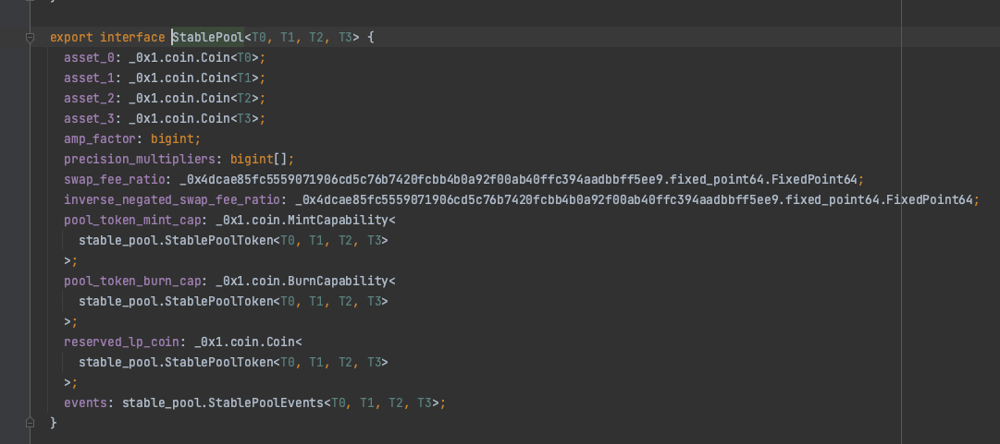

# Typemove 
Generate TypeScript bindings for Aptos contracts.
## Features
 - Code generation for Aptos smart contract based on ABI
 - Typesafe encode/decoding, object filtering, transaction building, etc
 - Automatically manage depended modules
## Usage
### Install package
```shell
yarn add @typemove/aptos
```
or 

```shell
pnpm add @typemove/aptos
```

### Code Generation
```typescript
yarn typemove-aptos <abi-address | path-of-entry-abi-file> <path-of-target-ts-directory> <testnet|mainnet>
```

e.g.
```typescript
yarn typemove-aptos 0x48271d39d0b05bd6efca2278f22277d6fcc375504f9839fd73f74ace240861af ./src/types mainnet
```

### Decode object

Generated type will be like this:


You can write code as follows:
```typescript
import { defaultMoveCoder } from '@typemove/aptos'
import { stable_pool } from "./types/0x48271d39d0b05bd6efca2278f22277d6fcc375504f9839fd73f74ace240861af";

const pool = await defaultMoveCoder().decodedType(stable_pool.StablePool.type(), object)
```

Checkout our [tests](./src/tests/move-coder.test.ts) for more examples。

### View function
Sample code is as follows:
```typescript
const aptosClient = new AptosClient("https://fullnode.mainnet.aptoslabs.com")
const [lpName] = await stable_pool.view.lpNameById(client, { arguments: [3n] })
const [poolBalances, weights, supply] = await stable_pool.view.poolInfo(client, { arguments: [lpName] })
```
IDE will show you the detail type of the function:


### Build transaction
Similar to view function, but use `entry` instead of `view`:
```typescript
const aptosClient = new AptosClient("https://fullnode.mainnet.aptoslabs.com")
const account = new AptosAccount(...)
const res = await _0x1.coin.entry.transfer(client, account, {
  type_arguments: ['0x1::aptos_coin::AptosCoin'],
  arguments: ['0x1', 1n],
})

```

Checkout our [tests](./src/tests/move-call.test.ts) for more examples.

### Resource utils
